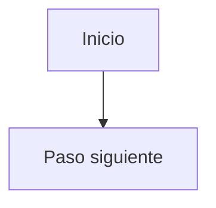
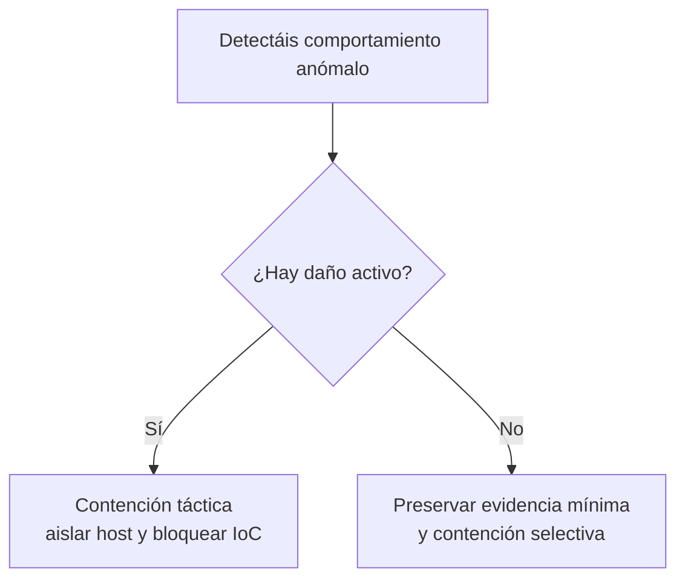
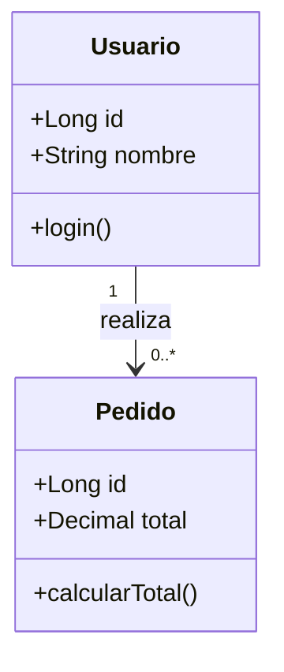
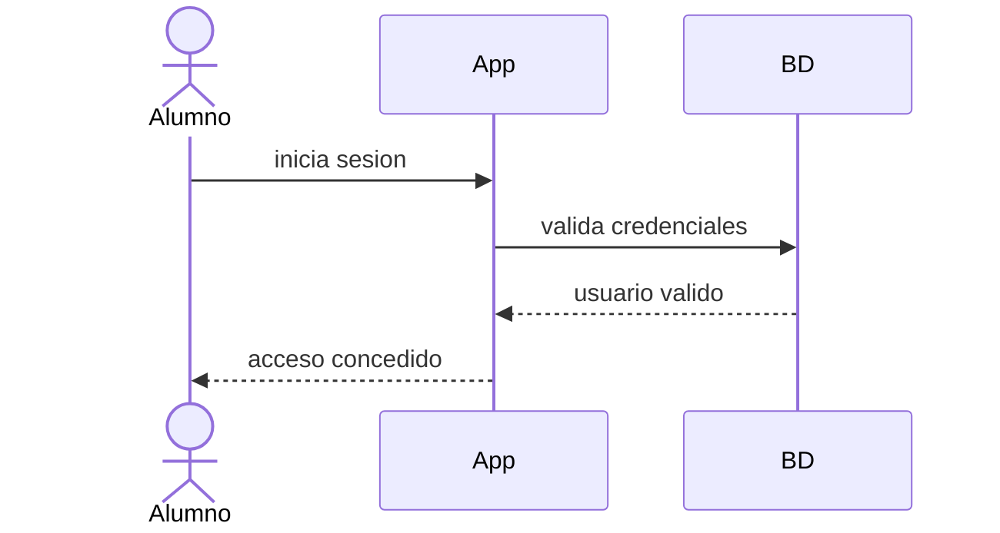
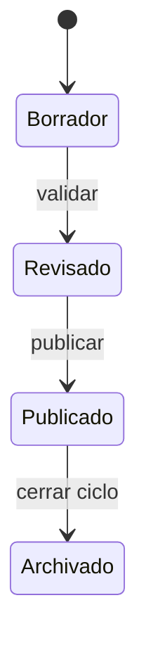

# Reglas Mermaid del repositorio

## Sintaxis base

- Usar bloques:

```markdown

```

## Reglas duras

- Para diagramas, usar siempre bloques ` ```mermaid `.
- En este repositorio Mermaid es estricto con ciertos caracteres en etiquetas.
- Si el texto de un nodo tiene paréntesis, signos de interrogación o
  exclamación, comillas, barras `/`, comas, dos puntos, tildes o caracteres no
  ASCII, poner la etiqueta entre comillas.
- Ejemplos seguros:
  - Rectángulo: `A["Texto ..."]`
  - Decisión: `B{"¿Pregunta ...?"}`
- No usar `\n` dentro de una etiqueta.
- Para saltos de línea, usar `<br/>` dentro del texto y entre comillas.
- Para aristas con texto, usar `-->|Sí|` o `-->|No|`.

## Diagnóstico rápido

- Si aparece `Syntax error in text`, normalmente Mermaid está cargado y el
  problema está en la sintaxis del diagrama.
- Revisar primero:
  - etiquetas sin comillas,
  - uso de `\n`,
  - caracteres especiales dentro de nodos.

## Plantillas útiles

### Flowchart explicativo



### UML de clases



### Diagrama de secuencia



### Diagrama de estados



## Criterios didácticos

- Preferir varios diagramas simples frente a uno demasiado cargado.
- Usar Mermaid para explicar, no solo para "decorar".
- En Programación y Entornos de desarrollo, es especialmente útil para:
  - UML de clases
  - diagramas de secuencia
  - diagramas de estados
  - flujos de compilación, pruebas, depuración o despliegue
