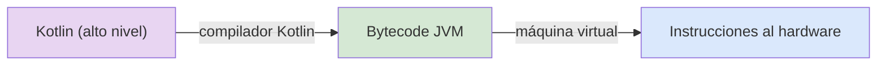
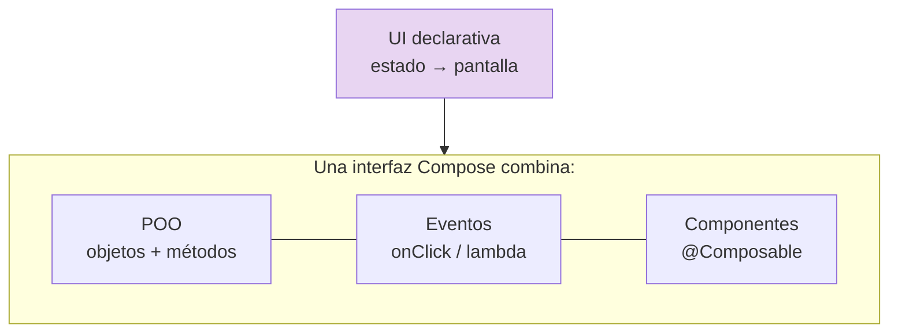

## 1.1. Paradigmas y modelos de programación

!!! abstract "Idea principal"
    Toda interfaz gráfica es software, y todo software se escribe siguiendo un paradigma. Antes de construir interfaces hay que entender los estilos de programación que las sustentan: imperativo, declarativo, orientado a objetos, por eventos y por componentes. Kotlin y Jetpack Compose combinan varios de ellos a la vez, y por eso los repasaremos con ejemplos reales de UI.

Un lenguaje de programación consiste en un conjunto de reglas y normas que permiten a una persona (en este caso un programador o programadora) escribir un conjunto de instrucciones interpretables por un ordenador, cuyo objetivo es controlar diferentes comportamientos lógicos o físicos de una máquina.

De manera tradicional se ha establecido una clasificación entre lenguajes de **bajo y alto nivel**:

- Los de **bajo nivel** se encuentran más cerca de lo que es capaz de entender un ordenador, ejercen un control directo sobre el hardware y están más alejados de la lógica humana (lenguaje máquina con 0 y 1, o lenguaje ensamblador). Resultan muy difíciles de entender por una persona.
- Los de **alto nivel** pueden ser descritos utilizando reglas comprensibles por el programador, con un lenguaje más cercano al natural. Será durante el proceso de compilación cuando estos se traduzcan a un lenguaje de bajo nivel capaz de ser entendido por la máquina.

<figure markdown>

<figcaption>El proceso de compilación traduce lenguajes de alto nivel (comprendibles por personas) a lenguajes de bajo nivel (comprendibles por la máquina). Fuente: temario del módulo.</figcaption>
</figure>



Las herramientas desarrolladas a través de un lenguaje de programación, sea del tipo que sea, requieren del desarrollo de una **interfaz** que permita la interacción con el usuario; de lo contrario, se requeriría que todos fuéramos programadores expertos para utilizar cualquier aplicación atendiendo a su lenguaje fuente.

!!! info "Qué deberías saber al terminar"
    Al acabar este tema deberías poder:

    - distinguir los paradigmas imperativo y declarativo con ejemplos;
    - explicar los modelos orientado a objetos, basado en eventos y basado en componentes;
    - reconocer qué paradigmas combina Jetpack Compose y por qué;
    - clasificar lenguajes habituales del desarrollo de interfaces en cada paradigma.

!!! tip "Mapa del tema"
    En este documento vamos a seguir esta secuencia:

    1. el paradigma imperativo y sus tipos;
    2. el paradigma declarativo y su papel en la UI moderna;
    3. los modelos POO, eventos y componentes;
    4. Kotlin y Compose como síntesis de todos ellos.

| Código | Descripción |
|--------|-------------|
| RA 1   | Genera interfaces gráficos de usuario mediante editores visuales utilizando las funcionalidades del editor y adaptando el código generado. |
| CE 1.a | Se ha creado un interfaz gráfico utilizando los asistentes de un editor visual. |
| CE 1.b | Se han utilizado las funciones del editor para ubicar los componentes del interfaz. |
| CE 1.d | Se ha adaptado el código generado por el editor para adaptarlo a las necesidades de la aplicación. |

### 1. El paradigma imperativo

Un **paradigma de programación** define un estilo de programación: describe la estructura del programa que va a dar solución a los problemas computacionales.

El modelo **imperativo** consiste en un conjunto de instrucciones ordenadas de forma secuencial y claramente definidas para su ejecución en una máquina; es decir, define un paso a paso. Se divide en otros tipos:

- **Programación estructurada.** Incluye estructuras de control que permiten evaluar los casos para decidir entre un camino de instrucciones u otro. También incorpora estructuras iterativas.
- **Programación procedimental o basada en funciones.** Subdivide el programa en subrutinas y funciones de menor tamaño que simplifican la programación, aligerando su implementación y posterior mantenimiento.
- **Programación modular.** Permite desarrollar cada programa de forma completamente independiente al resto del código, lo que agiliza las tareas de implementación y prueba. En la parte final del proceso se combinan todos los módulos, creando el software definitivo.

Algunos lenguajes conocidos que utilizan la programación imperativa son Java, C, C#, **Kotlin**, Python o Ruby.

<figure markdown>

<figcaption>Lenguajes de programación de alto nivel habituales en el desarrollo de software. Fuente: temario del módulo.</figcaption>
</figure>

```kotlin
// Imperativo puro: paso a paso, mutando estado
var total = 0
for (numero in lista) {
    if (numero % 2 == 0) {
        total += numero
    }
}
println("Suma de pares: $total")
```

### 2. El paradigma declarativo

En el modelo imperativo se indica la secuencia exacta de pasos que se ha de seguir para resolver un problema. Por el contrario, en el caso del modelo **declarativo** no se describen los pasos, sino el problema (el resultado) que se plantea. Algunos ejemplos de lenguajes declarativos son HTML, CSS y SQL.

```sql
-- Declarativo: describes QUÉ quieres, no CÓMO conseguirlo
SELECT nombre, apellidos FROM alumnado WHERE grupo = '2DAM';
```

```kotlin
// Kotlin también permite estilo declarativo/funcional
val total = lista.filter { it % 2 == 0 }.sum()
println("Suma de pares: $total")
```

!!! note "Aclaración"
    **Jetpack Compose es declarativo**: describes qué debe mostrar la interfaz para un estado dado, y el framework se encarga de cómo renderizarlo y de actualizar la pantalla cuando el estado cambia.

### 3. Programación orientada a objetos, eventos y componentes

Encontramos otros modelos de programación que incluyen características propias de los definidos anteriormente. Es el caso de la programación orientada a objetos, por eventos o por componentes. **La combinación de estos tres tipos resulta clave para el desarrollo de interfaces.**



#### 3.1. Modelo orientado a objetos

El funcionamiento de este tipo de programas se basa en la creación de entidades, que reciben el nombre de **objetos**, las cuales tienen asociados **atributos, propiedades y métodos**. La interacción entre los objetos permite resolver los problemas de computación planteados. Algunos lenguajes orientados a objetos son Java, Ruby, Visual Basic, Perl, PHP, Python o **Kotlin**.

```kotlin
// POO en Kotlin: una clase con atributos y métodos
class Contador(private val limite: Int = 10) {
    private var valor = 0

    fun incrementar() {
        if (valor < limite) valor++
    }

    fun obtenerValor(): Int = valor
}
```

#### 3.2. Modelo basado en eventos

Este modelo es uno de los más recientes. Su funcionamiento viene determinado por **acciones externas**, por ejemplo, la pulsación sobre un botón. Uno de los lenguajes típicos de este tipo de programación es JavaScript, que utiliza manejadores de eventos tanto en el lado del cliente como del servidor (Node.js).

```kotlin
// En Compose, los clics son eventos que se declaran junto al componente
Button(onClick = { pulsaciones++ }) {
    Text("Púlsame")
}
```

#### 3.3. Modelo basado en componentes

La clave de este último modelo es la **reutilización de módulos de software desarrollados previamente**. Para llevar a cabo esta tarea, la mayoría de los entornos de desarrollo integrados (IDE) permiten desarrollar componentes visuales, permitiendo empaquetar el código para reutilizarlo posteriormente.

```kotlin
// Un componible es un componente reutilizable: se define una vez...
@Composable
fun Saludo(nombre: String) {
    Text(text = "Hola, $nombre")
}

// ...y se reutiliza como cualquier otro componente de la biblioteca
// Saludo(nombre = "María")
```

### 4. Los tres modelos juntos en una interfaz Compose

El siguiente fragmento reúne los tres modelos en una sola pantalla de Jetpack Compose:

```kotlin
@Composable
fun PantallaContador() {
    // POO + estado: mutableStateOf guarda el valor observable
    var pulsaciones by remember { mutableStateOf(0) }

    // Componente: Column organiza otros componentes
    Column(
        modifier = Modifier
            .fillMaxSize()
            .padding(24.dp),
        horizontalAlignment = Alignment.CenterHorizontally
    ) {
        Text(text = "Pulsaciones: $pulsaciones", style = MaterialTheme.typography.headlineMedium)

        Spacer(modifier = Modifier.height(16.dp))

        // Evento: el clic actualiza el estado; la UI se redibuja sola
        Button(onClick = { pulsaciones++ }) {
            Text("Púlsame")
        }
    }
}
```

- **POO**: instanciamos y manipulamos objetos (`mutableStateOf`, `Modifier`, `Button`).
- **Evento**: `onClick` responde a la acción externa del usuario.
- **Componente**: `PantallaContador` es ahora un componente reutilizable en cualquier pantalla.

### 5. Buenas prácticas

- **Elige el paradigma según la capa**: lógica de negocio imperativa/funcional, interfaz declarativa. Forzar un único estilo en todo el proyecto suele empeorar el resultado.
- **Nombra los componentes por su función** (`PantallaContador`, `FilaAlumno`), igual que nombrarías una clase: son las piezas reutilizables de tu interfaz.
- **Estado mínimo**: guarda solo el estado imprescindible y deriva todo lo demás. Menos estado, menos errores de sincronización.
- **Un componente, una responsabilidad**: si un componible hace tres cosas distintas, son tres componibles.

### 6. Errores frecuentes

| Error frecuente | Por qué ocurre | Cómo evitarlo |
|-----------------|----------------|---------------|
| Pensar que Compose es "imperativo con otra sintaxis" | Venimos de manipular la UI manualmente | Pensar en "qué muestra la pantalla para este estado", no en "qué pasos doy para actualizarla" |
| Duplicar código de UI copiando y pegando | No se ve la UI como componentes | Extraer componibles con parámetros desde el primer momento |
| Mezclar lógica de negocio dentro de los componibles | Todo acaba viviendo en la pantalla | Mantener la lógica fuera (ViewModel, casos de uso) y la UI como capa de presentación |
| Creer que "declarativo" significa "sin lógica" | Confusión paradigma ≠ complejidad | La lógica sigue ahí; lo que cambia es dónde vive y cómo se expresa |

### 7. Resumen

En este tema has aprendido que:

- un paradigma de programación define el estilo y la estructura del programa;
- el modelo imperativo describe el paso a paso (estructurada, procedimental, modular) y el declarativo describe el resultado (HTML, CSS, SQL, y hoy la UI con Compose);
- los modelos orientado a objetos, basado en eventos y basado en componentes son la combinación clave del desarrollo de interfaces;
- Kotlin es multiparadigma y Jetpack Compose explota esa condición: POO + eventos + componentes con UI declarativa.

!!! success "Idea clave"
    Una interfaz Compose es un componente orientado a objetos que reacciona a eventos y se describe de forma declarativa: los cuatro paradigmas del tema trabajando juntos.

### 8. Para seguir practicando

- Ejercicios de la unidad: `DI-U1.-Ejercicios.md` (bloque A: paradigmas).
- Crear tu primer proyecto Compose: tema 1.2.
- Explorar los componentes del catálogo oficial: <https://developer.android.com/develop/ui/compose/components>

## Bibliografía y fuentes

- Android Developers. *Thinking in Compose*. <https://developer.android.com/develop/ui/compose/mental-model>
- Kotlin Foundation. *Kotlin docs*. <https://kotlinlang.org/docs/home.html>
- Real Decreto 450/2010. Módulo profesional 0488 Desarrollo de interfaces.
- Temario del módulo como base conceptual de la adaptación.
