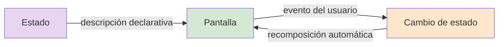
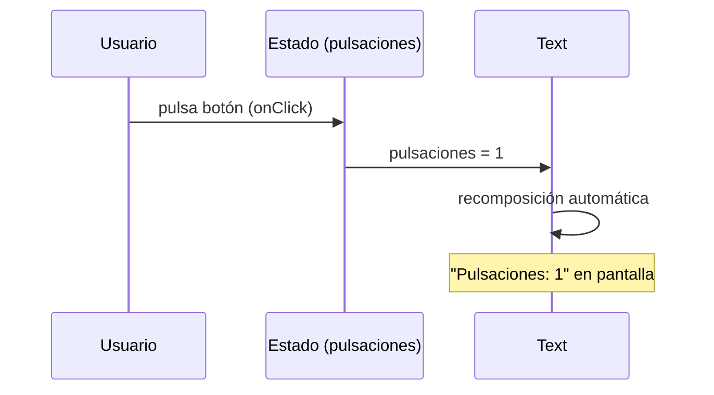

## 1.2. Kotlin y Jetpack Compose: la UI declarativa en acción

!!! abstract "Idea principal"
    Jetpack Compose es el kit de herramientas oficial para construir interfaces de usuario en Android con Kotlin. En lugar de diseñar ventanas en un editor gráfico y luego manipularlas desde código, **escribes la interfaz como funciones Kotlin que describen la pantalla para cada estado**, y el framework la actualiza sola cuando el estado cambia. Este tema es el primer contacto real: proyecto, componentes, eventos y estado.

!!! info "Qué deberías saber al terminar"
    Al acabar este tema deberías poder:

    - crear un proyecto Android con Compose desde Android Studio;
    - explicar qué es una función componible y escribir la primera;
    - usar componentes básicos (Text, Button, TextField) con sus propiedades;
    - manejar el estado con `remember` y `mutableStateOf`;
    - usar la previsualización (`@Preview`) como editor visual moderno.

!!! tip "Mapa del tema"
    En este documento vamos a seguir esta secuencia:

    1. qué es Jetpack Compose y por qué existe;
    2. el entorno: Android Studio;
    3. el primer proyecto y su anatomía;
    4. componentes, propiedades y eventos;
    5. estado y recomposición;
    6. casos prácticos resueltos.

| Código | Descripción |
|--------|-------------|
| RA 1   | Genera interfaces gráficos de usuario mediante editores visuales utilizando las funcionalidades del editor y adaptando el código generado. |
| CE 1.a | Se ha creado un interfaz gráfico utilizando los asistentes de un editor visual. |
| CE 1.b | Se han utilizado las funciones del editor para ubicar los componentes del interfaz. |
| CE 1.c | Se han modificado las propiedades de los componentes para adecuarlas a las necesidades de la aplicación. |
| CE 1.d | Se ha adaptado el código generado por el editor para adaptarlo a las necesidades de la aplicación. |

### 1. ¿Qué es Jetpack Compose y por qué existe?

**Jetpack Compose** es el toolkit declarativo de UI para Android, basado en funciones de Kotlin. Su unidad básica no es una clase de ventana ni un archivo de layout: es la **función componible**, una función normal de Kotlin anotada con `@Composable` que **describe un trozo de interfaz**.



Características clave:

- **Declarativo**: describes QUÉ se ve para cada estado, no CÓMO actualizarlo.
- **100% Kotlin**: la UI es código Kotlin normal (funciones, `if`, bucles `for`, variables).
- **Componentes por defecto**: `Text`, `Button`, `TextField`, `Column`, `Row`, `Image`... listos para usar.
- **Previsualización en vivo**: `@Preview` renderiza la interfaz en el IDE sin ejecutar la app.
- **Material 3 integrado**: colores, tipografía y formas del sistema de diseño de Google listos.

En Android Studio se programa en Kotlin y se apoya en **librerías**: conjuntos de clases y funciones ya implementadas que se reutilizan para cualquier desarrollo, reduciendo el tiempo de programación. Compose vive en los paquetes `androidx.compose.*`.

### 2. El entorno: Android Studio

**Android Studio** (basado en IntelliJ IDEA) es el IDE oficial: gratuito, multiplataforma e integra todo lo necesario:

- **Editor Kotlin** con autocompletado y detección de errores en tiempo real (líneas rojas onduladas).
- **Vista Split/Design**: código y previsualización renderizada lado a lado; también modo arrastrar-y-soltar.
- **Emulador de Android** integrado para ejecutar la app (Run ▶).
- **Layout Inspector** para inspeccionar la jerarquía de componentes en ejecución.
- **Git/GitHub** integrado para el control de versiones.

Instalación: <https://developer.android.com/studio> con las opciones por defecto del asistente. Incluye el **JDK** embebido y gestiona el SDK de Android automáticamente: no hay que instalar nada aparte.

### 3. El primer proyecto y su anatomía

*File → New → New Project → Empty Activity* (plantilla Compose), nombre, y Finish. Android Studio genera la estructura:

```text
DIUnidad1/
├── app/src/main/java/com/example/diunidad1/
│   └── MainActivity.kt        <- aquí vive la UI (Compose)
├── app/src/main/res/values/
│   ├── strings.xml             <- textos
│   ├── themes.xml              <- tema
│   └── ...
└── app/build.gradle.kts        <- dependencias (incluye BOM de Compose)
```

El corazón es `MainActivity.kt`:

```kotlin
package com.example.diunidad1

import android.os.Bundle
import androidx.activity.ComponentActivity
import androidx.activity.compose.setContent
import androidx.compose.foundation.layout.fillMaxSize
import androidx.compose.foundation.layout.padding
import androidx.compose.material3.MaterialTheme
import androidx.compose.material3.Scaffold
import androidx.compose.material3.Text
import androidx.compose.runtime.Composable
import androidx.compose.ui.Modifier

class MainActivity : ComponentActivity() {
    override fun onCreate(savedInstanceState: Bundle?) {
        super.onCreate(savedInstanceState)
        setContent {                    // <- punto de entrada de la UI
            MaterialTheme {
                Scaffold(modifier = Modifier.fillMaxSize()) { innerPadding ->
                    MiPrimeraInterfaz(Modifier.padding(innerPadding))
                }
            }
        }
    }
}

@Composable
fun MiPrimeraInterfaz(modifier: Modifier = Modifier) {
    Text(
        text = "Mi primera interfaz",
        modifier = modifier
    )
}
```

Anatomía del código:

| Pieza | Papel |
|-------|-------|
| `ComponentActivity` | La "pantalla" del sistema operativo que aloja la UI |
| `setContent { ... }` | Monta la interfaz declarativa dentro de la actividad |
| `MaterialTheme` | Aplica colores, tipografía y formas de Material 3 |
| `Scaffold` | Estructura básica de pantalla (barras, zona de contenido) |
| `MiPrimeraInterfaz` | **Tu primer componible**: describe el contenido |

No existe el concepto clásico de "tamaño de ventana": la app se adapta a la pantalla del dispositivo (móvil, tablet, foldable) y su ciclo de vida lo gestiona el sistema.

!!! note "Nota"
    Al escribir componibles, las importaciones de `androidx.compose.*` las añade el IDE con **Alt+Intro** sobre el símbolo en rojo. No hace falta memorizarlas.

### 4. Componentes, propiedades y eventos

Los componentes de Compose son funciones con **parámetros** que equivalen a las clásicas "propiedades" de un control visual:

```kotlin
@Composable
fun BotonesAceptarCancelar(modifier: Modifier = Modifier) {
    Row(modifier = modifier.padding(16.dp)) {
        Button(
            onClick = { /* acción al pulsar */ },
            colors = ButtonDefaults.buttonColors(
                containerColor = MaterialTheme.colorScheme.primary
            ),
            enabled = true
        ) {
            Text("Aceptar")
        }
        Spacer(modifier = Modifier.width(12.dp))
        OutlinedButton(onClick = { /* acción */ }) {
            Text("Cancelar")
        }
    }
}
```

| Componente | Para qué | Propiedades típicas |
|------------|----------|---------------------|
| `Text` | Mostrar texto | `text`, `style`, `color`, `textAlign` |
| `Button` | Botón relleno | `onClick`, `colors`, `enabled` |
| `OutlinedButton` | Botón delineado | `onClick`, `colors`, `enabled` |
| `TextField` | Campo de texto editable | `value`, `onValueChange`, `label` |
| `Column` / `Row` / `Box` | Contenedores (vertical/horizontal/caja) | `verticalArrangement`, `horizontalAlignment` |
| `Image` | Mostrar imagen | `painter`, `contentDescription` |
| `Spacer` | Espacio en blanco | `modifier = Modifier.height(8.dp)` |

El **evento** no se registra aparte: la lambda `onClick` ES el manejador, declarado junto al componente. Componente, propiedades y comportamiento viven juntos — una de las grandes victorias de Compose.

!!! example "Cómo queda en ejecución"
    ```text
    ┌─────────────────────────┐
    │                         │
    │  [ Aceptar ]  [ Cancelar ]  <- Row con Button + OutlinedButton
    │                         │
    └─────────────────────────┘
    ```
    Dos botones Material 3 lado a lado (12 dp de separación), relleno el primero y delineado el segundo, texto centrado y la ondulación (ripple) característica al pulsarlos en el emulador.

### 5. Estado y recomposición

La pieza que lo cambia todo: declaras la UI en función de un **estado observable**, y cuando el estado cambia, las funciones que dependen de él se **recomponen** (vuelven a ejecutarse) automáticamente.

```kotlin
@Composable
fun ContadorPulsaciones() {
    var pulsaciones by remember { mutableStateOf(0) }   // estado observable

    Column(
        modifier = Modifier.fillMaxSize().padding(24.dp),
        horizontalAlignment = Alignment.CenterHorizontally
    ) {
        Text("Pulsaciones: $pulsaciones", style = MaterialTheme.typography.headlineMedium)
        Spacer(Modifier.height(16.dp))
        Button(onClick = { pulsaciones++ }) {           // evento -> cambia estado
            Text("Púlsame")
        }
    }
}
```



- `mutableStateOf(0)` crea el estado observable (valor inicial 0).
- `remember` conserva el valor entre recomposiciones.
- `pulsaciones++` dentro de `onClick` cambia el estado; Compose detecta que `Text` lo lee y redibuja solo ese texto.

!!! warning "Atención"
    Si una variable normal de Kotlin cambia, la pantalla no se entera. **Solo el estado observable (`mutableStateOf`) dispara la recomposición.** Y sin `remember`, el valor se resetearía en cada recomposición.

### 6. La previsualización: el editor visual moderno

La anotación **`@Preview`** sobre una función componible hace que Android Studio la renderice en un panel lateral sin ejecutar la app, actualizándose mientras escribes:

```kotlin
@Preview(showBackground = true)
@Composable
fun BotonesPreview() {
    MaterialTheme {
        BotonesAceptarCancelar()
    }
}
```

- Puedes tener tantas previews como quieras (un botón habilitado, otro deshabilitado, un estado vacío, otro lleno).
- El modo *Design* permite arrastrar componentes desde la paleta al lienzo, generando el código Kotlin.
- **Interactive Mode** (icono play de la preview) permite pulsar botones y navegar la interfaz sin ejecutar nada.

### 7. Casos prácticos resueltos

#### Caso práctico 1: "Mi primera pantalla con estado"

**Planteamiento.** Crear una pantalla de bienvenida desde cero y comprobar su renderizado en preview y emulador.

**Desarrollo.**

```kotlin
@Composable
fun PantallaBienvenida(modifier: Modifier = Modifier) {
    Column(
        modifier = modifier.fillMaxSize().padding(32.dp),
        verticalArrangement = Arrangement.Center,
        horizontalAlignment = Alignment.CenterHorizontally
    ) {
        Text("Bienvenid@", style = MaterialTheme.typography.displaySmall)
        Spacer(Modifier.height(8.dp))
        Text("Desarrollo de Interfaces · 2º DAM", style = MaterialTheme.typography.bodyLarge)
    }
}
```

**Desenlace.** En el emulador: dos textos centrados vertical y horizontalmente, con tipografías del tema. Todo es código desde el primer minuto: la preview es un espejo del código, no un editor que genera código oculto.

#### Caso práctico 2: "Aceptar y Cancelar con comportamiento"

**Planteamiento.** Dos botones que muestren cuál se ha pulsado en una etiqueta.

**Desarrollo.**

```kotlin
@Composable
fun AceptarCancelar(modifier: Modifier = Modifier) {
    var mensaje by remember { mutableStateOf("Sin acción") }

    Column(
        modifier = modifier.fillMaxSize().padding(24.dp),
        verticalArrangement = Arrangement.Center,
        horizontalAlignment = Alignment.CenterHorizontally
    ) {
        Text(mensaje, style = MaterialTheme.typography.titleLarge)
        Spacer(Modifier.height(24.dp))
        Row {
            Button(onClick = { mensaje = "Has aceptado" }) { Text("Aceptar") }
            Spacer(Modifier.width(12.dp))
            OutlinedButton(onClick = { mensaje = "Has cancelado" }) { Text("Cancelar") }
        }
    }
}
```

**Desenlace.** Al pulsar cada botón, la etiqueta superior cambia al instante sin una sola línea de "actualizar la etiqueta": cambia el estado `mensaje` y Compose recompone el `Text`. El flujo de datos es automático y unidireccional: evento → estado → pantalla.

### 8. Buenas prácticas

- **Previews para todo**: cada componente con su `@Preview` (o varias) — es tu editor visual permanente y gratis.
- **Extrae componibles en cuanto repitas** código: si dos pantallas tienen el mismo encabezado, es un componible `Encabezado()`.
- **Estilo al tema, no al componente**: usa `MaterialTheme.colorScheme` y `typography` en vez de colores sueltos; cambiar el tema cambia toda la app.
- **Depura el estado, no la pantalla**: si la UI no se actualiza, casi siempre es que el estado no es observable o no está recordado donde toca.

### 9. Errores frecuentes

| Error frecuente | Por qué ocurre | Cómo evitarlo |
|-----------------|----------------|---------------|
| Escribir `Text("...")` sin importar y rendirse | Faltan importaciones de `androidx.compose` | Alt+Intro sobre el símbolo en rojo |
| Estado que "se resetea" solo | `mutableStateOf` sin `remember` | Envolver siempre: `remember { mutableStateOf(...) }` |
| Modificar una variable normal y esperar que la UI cambie | Kotlin no sabe que esa variable afecta a la pantalla | Solo el estado observable dispara la recomposición |
| Pelear con tamaños fijos | Herencia del pensamiento "ventana de escritorio" | Pensar en adaptativo: `fillMaxSize`, `weight`, constraints |
| Olvidar `dp` en paddings | `24` sin unidad no compila | `24.dp` (y para fuentes, `sp`) |

### 10. Resumen

En este tema has aprendido que:

- Jetpack Compose es el toolkit declarativo de UI para Android basado en funciones componibles Kotlin;
- la unidad de construcción es la función `@Composable`, que describe la interfaz para un estado dado;
- los componentes (`Text`, `Button`, `TextField`, `Column`...) reciben propiedades como parámetros y eventos como lambdas;
- el estado observable (`remember` + `mutableStateOf`) y la recomposición automática sustituyen cualquier actualización manual de la pantalla;
- `@Preview` es el editor visual moderno: previsualización en vivo, múltiples estados y modo interactivo.

!!! success "Idea clave"
    La interfaz es una función del estado: UI = f(estado). Cuando el estado cambia, la pantalla se redibuja sola. Todo lo demás del módulo construye sobre esta idea.

### 11. Para seguir practicando

- Ejercicios de la unidad: `DI-U1.-Ejercicios.md` (bloques B y C).
- Codelab oficial: *Jetpack Compose basics* <https://developer.android.com/codelabs/jetpack-compose-basics>
- Catálogo de componentes: <https://developer.android.com/develop/ui/compose/components>

## Bibliografía y fuentes

- Android Developers. *Jetpack Compose documentation*. <https://developer.android.com/develop/ui/compose>
- Android Developers. *Thinking in Compose*. <https://developer.android.com/develop/ui/compose/mental-model>
- Android Developers. *State and Jetpack Compose*. <https://developer.android.com/develop/ui/compose/state>
- Kotlin Foundation. *Kotlin docs*. <https://kotlinlang.org/docs/home.html>
- Real Decreto 450/2010. Módulo profesional 0488 Desarrollo de interfaces.
