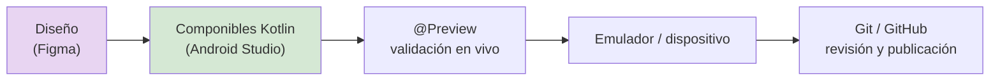

## 1.3. Herramientas de edición de interfaces

!!! abstract "Idea principal"
    La motivación principal para utilizar herramientas de desarrollo basado en componentes visuales es la reutilización: una vez empaquetados, los componentes se comparten con otros desarrolladores. Un buen editor de interfaces acelera el ciclo diseñar → previsualizar → generar código → depurar. Repasamos el panorama clásico y el actual, porque seguirán apareciendo en proyectos heredados y en el mercado laboral.

Si no se desarrolla utilizando componentes y se realiza de manera directa, se producirá un incremento de tiempo y costes asociados al proyecto.

!!! info "Qué deberías saber al terminar"
    Al acabar este tema deberías poder:

    - comparar los IDE clásicos de edición de interfaces y sus licencias;
    - justificar la elección de Android Studio para este módulo;
    - conocer herramientas complementarias actuales (Figma, Compose Multiplatform, Preview).

| Código | Descripción |
|--------|-------------|
| RA 1   | Genera interfaces gráficos de usuario mediante editores visuales utilizando las funcionalidades del editor y adaptando el código generado. |
| CE 1.a | Se ha creado un interfaz gráfico utilizando los asistentes de un editor visual. |
| CE 1.b | Se han utilizado las funciones del editor para ubicar los componentes del interfaz. |

### 1. El panorama clásico

| Nombre | Licencia | Lenguajes soportados | Enlace |
|--------|----------|----------------------|--------|
| Visual Studio | Propietaria (Community libre) | C#, HTML, JavaScript, XML, F# | visualstudio.microsoft.com/es/ |
| MonoDevelop | Libre | C#, Java, .NET, Python | monodevelop.com |
| Glade | Libre | C, C++, C#, Java, Python (GTK) | glade.gnome.org |
| NetBeans | Libre | Java, HTML, PHP, Python | netbeans.org |
| Eclipse | Libre | Java, C++, PHP | eclipse.org |

**Visual Studio.** Entre sus fortalezas: lenguajes multiplataforma (C#, F#, Razor, HTML5, CSS, JavaScript, TypeScript, XAML, XML), autocompletado con detección de errores en tiempo real (líneas rojas onduladas), depuración paso a paso con puntos de interrupción y administración de código en Git, GitHub y Azure DevOps.

**MonoDevelop.** IDE libre y gratuito con editor, depurador y gestión de proyectos. Perteneció al ecosistema de Unity (motor de videojuegos multiplataforma) e interesa porque permitía desarrollar para Windows, macOS y Linux.

<figure markdown>

<figcaption>MonoDevelop diseñando una ventana con su editor visual: paleta de componentes a la derecha, lienzo al centro y propiedades. Fuente: temario del módulo.</figcaption>
</figure>

**Glade.** Ayuda a la creación de interfaces GTK y está muy ligada a entornos XML. Es intuitiva y rápida de aprender, y su diferencia principal es que está diseñada para GNU/Linux.

<figure markdown>

<figcaption>Glade editando una ventana GTK+: paleta superior de componentes, lienzo central e inspección de propiedades a la derecha. Fuente: temario del módulo.</figcaption>
</figure>

**NetBeans.** Gratuito y de código abierto; junto a Eclipse, de los más usados para interfaces Java. Se extiende con módulos que agrupan clases y permiten interactuar con sus APIs.

**Eclipse.** De código abierto y multiplataforma. Su Graphical Layout permitía visualizar el diseño y crear componentes visuales de forma rápida con su panel Palette (botones, cuadros de texto, cuadrículas, imágenes...).

!!! note "Aclaración"
    MonoDevelop y Glade ilustran la idea permanente de este tema: **paleta de componentes + lienzo + panel de propiedades**. Ese patrón de editor visual es el mismo que hoy ofrece Android Studio con su vista Design para Compose.

### 2. El panorama actual

| Nombre | Licencia | Enfoque | Papel hoy |
|--------|----------|---------|-----------|
| Android Studio | Libre (IntelliJ) | Kotlin/Java + Compose | El IDE de este módulo |
| IntelliJ IDEA | Community libre / Ultimate propietaria | Kotlin, Java, JVM | Base de Android Studio; apps de escritorio con Compose Multiplatform |
| Visual Studio / VS Code | Propietaria / MIT | .NET / multilenguaje | Escritorio (WPF, WinUI), web y multiplataforma |
| Figma | Freemium (proprietaria) | Diseño de interfaces | Estándar de diseño previo a codificar |
| Flutter / React Native | Open source | Multiplataforma móvil | Alternativas a Compose |

**Android Studio** reúne todo lo que pedíamos a los clásicos y más: editor visual (Design/Split + paleta arrastrable), `@Preview` en vivo, emulador integrado, Layout Inspector, profiler de rendimiento y Git/GitHub integrados.

**Figma** ocupa un lugar nuevo en el flujo: **diseñar antes de programar**. El prototipo se comparte con el cliente y luego se traduce a componibles (incluso hay plugins que generan código Compose desde el diseño). Es el estándar de la industria para pasar de la idea al mockup.

**Compose Multiplatform** extiende Compose más allá de Android: la misma UI declarativa para escritorio (Windows/macOS/Linux), iOS y web. Kotlin demuestra así que el paradigma aprendido en este módulo no se queda en el móvil.

!!! example "Ejemplo: flujo de trabajo real 2026"
    1. La diseñadora monta el prototipo en Figma y lo comparte con el equipo.
    2. El equipo de desarrollo lo traduce a componibles en Android Studio (a veces con ayuda de plugins de generación).
    3. Cada componente se valida con `@Preview` y en el emulador.
    4. El código vive en GitHub; cada pull request revisa el diseño y la lógica.

### 3. Elección de herramienta: criterios

A la hora de elegir entorno se aplica el mismo razonamiento de siempre: depende del lenguaje y del tipo de interfaz. En nuestro caso:

- **Lenguaje**: Kotlin (moderno, seguro, soportado por Google como principal para Android).
- **Plataforma**: Android en primer lugar (móvil), con salida natural a escritorio vía Compose Multiplatform.
- **Ecosistema**: Jetpack Compose, Material 3, AndroidX.
- Por tanto: **Android Studio** como IDE principal del módulo, con Figma como herramienta de diseño previo cuando el proyecto lo pida.

### 4. Buenas prácticas

- **No cambies de IDE a mitad de proyecto**: cada uno genera su propia configuración y formateo; migrar a mitad de sprint cuesta más de lo que aporta.
- **Aprende los atajos del editor**: Alt+Intro (importar), Shift+F10 (ejecutar), Ctrl+B (ir a declaración). El ratón es el enemigo de la velocidad.
- **Usa el control de versiones desde el minuto 1**: Android Studio lo trae integrado; crear el repo al crear el proyecto.
- **Diseña antes de codificar**: aunque sea un boceto en papel o Figma, decidir la jerarquía de componentes antes de escribirlos evita reescrituras.

### 5. Errores frecuentes

| Error frecuente | Por qué ocurre | Cómo evitarlo |
|-----------------|----------------|---------------|
| Empezar a codificar sin decidir la plataforma | Cada plataforma condiciona lenguaje y herramientas | Decidir primero: ¿escritorio, móvil, web? y luego cadena de herramientas |
| Ignorar Figma y diseñar en la cabeza | "Total, es una app pequeña" | El mockup previo detecta problemas de flujo antes de escribir código |
| Duplicar proyectos para "probar cosas" sin control de versiones | Prisas | Un solo repo, ramas para experimentos |
| Tratar la preview como decoración | Se ejecuta la app para cada cambio | Preview + Interactive Mode validan en segundos sin emulador |

### 6. Resumen

En este tema has aprendido que:

- el panorama clásico (Visual Studio, MonoDevelop, Glade, NetBeans, Eclipse) sigue existiendo en proyectos heredados y comparte el patrón paleta + lienzo + propiedades;
- hoy el estándar para interfaces móviles Kotlin es Android Studio, con vista Design y `@Preview`;
- Figma añade la fase de diseño colaborativo previa al código;
- Compose Multiplatform lleva la UI declarativa a escritorio, iOS y web con el mismo conocimiento.

!!! success "Idea clave"
    Las herramientas cambian, pero el concepto de editor visual con generación de código y previsualización en vivo es el mismo desde hace 20 años. Aprende el concepto y sobrevivirás a cualquier herramienta.

### 7. Para seguir practicando

- Ejercicios de la unidad: `DI-U1.-Ejercicios.md` (bloque A, ejercicio de comparativa).
- Explora el catálogo de Figma (figma.com/community) buscando "material 3 ui kit".

## Bibliografía y fuentes

- Android Studio. <https://developer.android.com/studio>
- JetBrains, Compose Multiplatform. <https://www.jetbrains.com/lp/compose-multiplatform/>
- Figma. <https://figma.com>
- Temario del módulo como base conceptual de la adaptación.
