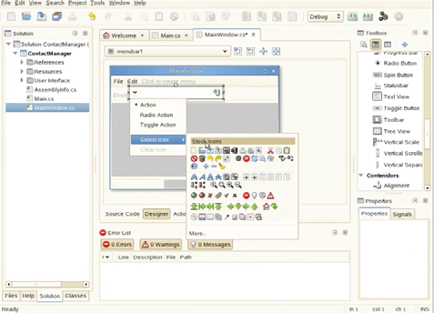

# DI-U1.1 - Introducción a la confección de interfaces

Note: Bienvenid@ al módulo de Desarrollo de Interfaces. Esta unidad es la puerta de entrada: antes de escribir interfaces modernas tenemos que entender qué paradigmas las sostienen. **El hilo conductor de todo el módulo es Kotlin y Jetpack Compose**, la pila actual de Google para Android. La pregunta que guía la unidad: ¿qué hay debajo de una interfaz?

---


 <!-- .element height="50%" -->

Note: Presentamos el módulo dentro de 2º DAM. Este primer tema sienta las bases conceptuales: paradigmas, modelos y herramientas. Quien entienda los conceptos podrá trabajar con cualquier framework del mercado.

---


## Índice

Note: Seguimos tres bloques: primero los paradigmas y modelos de programación; después el primer contacto real con Kotlin y Compose; y cerramos con las herramientas de edición.


### Índice I

- Paradigmas: imperativo y declarativo
- Modelos: objetos, eventos, componentes
- Kotlin y Jetpack Compose

Note: El primer bloque es conceptual pero no teórico vacío: cada paradigma lo veremos con código Kotlin real. Insistir en que **los tres modelos juntos son la clave del desarrollo de interfaces**, como dice la propia normativa del módulo.


### Índice II

- Primer proyecto y componentes
- Estado y recomposición
- Herramientas: de los clásicos a Android Studio

Note: El segundo bloque es la parte práctica: montar el primer proyecto, escribir componibles y entender el estado. Y el tercero pone el contexto de herramientas. Con eso quedan listos para los ejercicios.

---


## ¿Qué es una interfaz?

Note: Empezamos por la motivación: por qué existen las interfaces y por qué son una disciplina propia dentro del desarrollo.


### Sin interfaz, todos programadores

- Las apps requieren interacción con el usuario
- Sin GUI: leer el lenguaje fuente
- La interfaz traduce persona ↔ máquina

Note: Un lenguaje de programación permite escribir instrucciones interpretables por un ordenador. Sin interfaz, para usar cualquier aplicación habría que ser programador experto y leer su código fuente. **La interfaz es la capa que nos salva a todos.**


### Lenguajes de bajo y alto nivel

- Bajo nivel: máquina (0 y 1), ensamblador
- Alto nivel: cercano al natural
- La compilación traduce a bajo nivel

Note: Los de bajo nivel controlan el hardware directamente pero son ilegibles para personas. Los de alto nivel se escriben con reglas comprensibles y **el compilador los traduce**. Kotlin es de alto nivel: compila a bytecode JVM.

---


## Paradigmas

Note: Un paradigma define un estilo de programación: cómo estructuramos el programa que resuelve el problema. Los dos grandes: imperativo y declarativo.


### Imperativo: el paso a paso

- Estructurada: secuencias, condiciones, bucles
- Procedimental: funciones y subrutinas
- Modular: piezas independientes que se combinan
- Java, C, C#, Kotlin, Python...

Note: El imperativo dice CÓMO: pasos ordenados. Se subdivide en estructurada (estructuras de control), procedimental (subrutinas) y modular (piezas independientes que se ensamblan al final). Ejemplo en pizarra: sumar pares de una lista con un bucle.


### Declarativo: el qué

- Describes el resultado, no los pasos
- HTML, CSS, SQL
- Kotlin también sabe ser declarativo

Note: El declarativo dice QUÉ: SQL pide los datos de 2DAM sin explicar cómo recorrer la tabla. Y ojo: Kotlin con `filter` y `count` también es declarativo. **Jetpack Compose es declarativo**: describimos la pantalla para un estado. Es el corazón del módulo.


### Los tres modelos clave

1. Orientado a objetos: entidades con atributos y métodos
2. Basado en eventos: acciones externas dirigen el flujo
3. Basado en componentes: reutilización de módulos visuales

Note: Los tres modelos que combina toda interfaz. POO: objetos que interactúan. Eventos: el clic gobierna. Componentes: empaquetar y reutilizar. La normativa del módulo pide exactamente esta combinación. En el tema 1.2 la veremos entera en un solo archivo Compose.

---


## Kotlin y Jetpack Compose

Note: Ahora el primer contacto real con la pila del módulo: qué es Compose, por qué existe y cómo se programa.


### ¿Qué es un componible?

```kotlin
@Composable
fun Saludo(nombre: String) {
    Text(text = "Hola, $nombre")
}
```

Note: La unidad básica de Compose NO es una clase de ventana ni un archivo de layout: es una función de Kotlin anotada con @Composable que **describe** un trozo de interfaz. Se define una vez y se reutiliza en cualquier pantalla: eso es el modelo de componentes en estado puro.


### Componentes y propiedades

- Text, Button, OutlinedButton, TextField
- Propiedades = parámetros de la función
- Evento: onClick junto al componente

Note: Los componentes son funciones con parámetros que equivalen a las propiedades clásicas: text, enabled, colors, style. Y el gran avance de Compose: **componente, propiedades y evento viven juntos**. El onClick ES el manejador del evento, declarado junto al botón.


### Estado y recomposición

- Estado: `remember { mutableStateOf(0) }`
- Evento cambia el estado
- La pantalla se redibuja sola

Note: La idea que lo cambia todo: declaras la UI en función de un estado observable, y cuando el estado cambia, las funciones que dependen de él se re-ejecutan solas. Si piensas "qué tengo que actualizar" vas mal; piensa "de qué estado depende esta pantalla". UI = f(estado).

---


## Herramientas

Note: Cerramos con el panorama de herramientas: de los IDE clásicos con editor visual al flujo moderno.


### El patrón clásico

 <!-- .element height="45%" -->

Note: MonoDevelop, Glade, Eclipse, NetBeans, Visual Studio: todos comparten el mismo patrón que sigue vivo hoy: **paleta de componentes + lienzo + panel de propiedades**. Las capturas del temario (MonoDevelop con su diseñador, Glade editando una ventana GTK) muestran ese patrón universal del editor visual.


### El flujo actual

- Figma → diseño compartido
- Android Studio → componibles Kotlin
- Preview → validación en vivo
- GitHub → revisión y publicación

Note: El flujo 2026: la diseñadora prototipa en Figma, el equipo traduce a componibles, cada componente se valida con @Preview sin ejecutar nada, y todo vive en Git. Las herramientas cambian; **el concepto de editor visual con previsualización en vivo lleva 20 años igual**. Aprende el concepto y sobrevive a cualquier herramienta.

---


## Cierre

Note: Recapitulamos y enlazamos con los ejercicios de la unidad.


### Resumen

- Paradigmas: imperativo (cómo) vs declarativo (qué)
- POO + eventos + componentes: el trío de las interfaces
- Compose = declarativo + componentes Kotlin
- Android Studio: el editor visual moderno

Note: Las cuatro ideas de la unidad. La síntesis: una interfaz Compose es un componente orientado a objetos que reacciona a eventos y se describe de forma declarativa. **Los paradigmas del tema trabajando juntos en un solo archivo.**


### Ejercicios y siguiente unidad

- Bloques A-D: de conceptos a la calculadora
- Solucionario disponible: consultar después de intentar
- UD 2: layouts y diseño adaptativo

Note: Los ejercicios van del calentamiento conceptual (bloque A) a la calculadora completa por componentes (bloque D). Recordar el método: intentar primero, solucionario después. Y avanzar el temario: la siguiente unidad profundiza en layouts.
